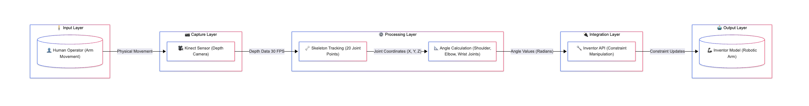

# Kinventor - plugin for manipulation of a robotic arm model using KINECT SDK through Inventor API

A proof-of-concept application that enables real-time control of a robotic arm CAD model using Natural User Interface (NUI) through Microsoft Kinect's skeleton tracking capabilities.

## Project Overview
This project was developed as a Bachelor's Thesis at AGH University of Science and Technology (Kraków, Poland) in 2012-2013. It explores the feasibility of using consumer-grade depth cameras for controlling anthropomorphic robotic arm models.

## Key Concept
The system bridges Microsoft Kinect SDK skeleton tracking with Autodesk Inventor API, allowing users to manipulate a 3D CAD model of a robotic arm by moving their own arm in front of the Kinect sensor.

## Features

* Real-time skeleton tracking using Kinect for Xbox 360
* Direct CAD model manipulation through Inventor 2013 API
* Anthropomorphic arm mapping - 4 elements representing:
* Visual feedback with skeleton overlay and coordinate display
* Inventor plugin integration - accessible from the ribbon interface
* Configurable tracking options (left/right arm selection)

## Install prerequisites:

- Kinect SDK 1.8
- Autodesk Inventor 2013 + Developer Tools (DeveloperTools.msi)

##  Usage

Connect Kinect sensor to your PC
Open Autodesk Inventor 2013 and load the robotic arm assembly
Launch the application from Inventor's ribbon (under "Assembly" → "Praca Inżynierska" panel)
Stand in front of the Kinect (1.2m - 4m optimal distance)
Move your arm - the CAD model will mirror your movements in real-time

## How It Works
### Skeleton Tracking
The Kinect SDK provides 20 skeletal joint positions in Cartesian coordinates (meters). The application focuses on 4 key joints:

* ShoulderCenter / ShoulderLeft / ShoulderRight
* ElbowLeft / ElbowRight
* WristLeft / WristRight
* HandLeft / HandRight

### Angle Calculation
Joint angles are calculated using vector mathematics between consecutive skeletal points and mapped to Inventor's "Angle" constraints.

### Inventor API Integration
The application uses COM Automation through Primary Interop Assemblies (PIA) to:

* Access AssemblyDocument and AssemblyComponentDefinition
* Modify angle constraints programmatically
* Update the model in real-time using "Transient Geometry" concepts

## Limitations

* 2D simplified model - rotation constrained to single axis per joint
* No collision detection - for performance optimization
* Single user tracking - tracks first detected user only
* Windows only - due to Kinect SDK and Inventor API dependencies
* Legacy software - Kinect v1 and Inventor 2013 are no longer actively supported

## Background
Natural User Interfaces (NUI)
This project explores the evolution from CLI → GUI → NUI, drawing inspiration from:

Steve Mann's wearable computing experiments (1970s-present)
* MIT's Put-That-There (1980) - voice and gesture control
* IBM DreamSpace (1998) - 3D gesture manipulation
* Minority Report UI (1999/2002) - designed by John Underkoffler

The Kinect's depth sensing uses structured infrared light projection with a pseudo-random dot pattern, developed by Israeli company PrimeSense (patent 20100201811).

## Thesis
The complete thesis (in Polish) is available:

[PDF Document](doc/Manipulacja%20modelem%20ramienia%20robotycznego%20z%20użyciem%20KINECT%20SDK%20przy%20pomocy%20Inventor%20API.pdf)

**Title:** Manipulacja modelem ramienia robotycznego z użyciem KINECT SDK przy pomocy Inventor API

**Translation:** Manipulation of a robotic arm model using KINECT SDK through Inventor API

**Author:** Artur Skowroński

**Thesis supervisor:** Dr inż. Tomasz Buratowski

**University:** AGH University of Science and Technology, Kraków

**Faculty:** Mechanical Engineering and Robotics

**Field:** Automation and Robotics

**Year:** 2012/2013
